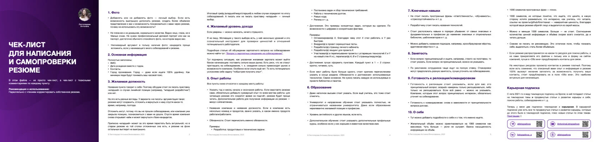

# Консультации

Перед записью на консультацию рекомендую почитать мой [Telegram](https://t.me/alistopadova), чтобы понимать, чего ожидать от консультации. Для более глубокого погружения есть платная подписка для инженеров и руководителей — о ней детальнее [тут]().

Я консультирую по трём темам:
1. Карьерный аудит перед поиском работы.
2. Аудит готовности к следующему грейду.
3. Переход в роль руководителя разработки (тимлида).

И — [якорь на описание формата консультации](#формат-консультаций-и-этапы).

## Карьерный аудит перед поиском работы

Стоимость: 15 000 ₽

**Для кого:**
- Мидл/старшие разработчики и линейные руководители разработки, которые планируют выходить на рынок через 1–6 месяцев.

Если вы младший разработчик и у вас от полугода опыта — для уточнения стоимости напишите лично.

**Что входит:**
* Предварительное изучение резюме + мои уточняющие вопросы.
* 60 – 90 минут созвона.
* Анализ опыта относительно рынка.
* Выявление слабых мест.
* Рекомендации по резюме.
* Рекомендации навыков и достижений, которые выгодно и стоит наработать до начала поиска.
* Возможность задать два вопроса в личных сообщениях ig/tg в течении недели после консультации: отвечу письменно или аудио.

**Что у вас будет по итогу:**
* Перечень доработок резюме.
* План подготовки на 2 – 3 месяца.

Вариант для тех, у кого есть опасение и/или нежелание «потратить полгода на подготовку к поиску работы и потом узнать, что отсеивают из-за очевидных вещей».

[Вот тут можно скачать мой бесплатный PDF с подробным чек-листом для написания и самопроверки](https://t.me/alistopadova/1486). Он актуальный. Пожалуйста, проверьте и поправьте по нему резюме, тогда мы сэкономим время на менее очевидные моменты.

Я не пишу резюме за другого человека, а прохожусь по присланному резюме и говорю о каждом поле что вызывает вопросы, что лучше убрать, изменить, задаю дополнительные вопросы, помогающие раскрыть опыт и дописать важные моменты: помогаю его улучшить и при этом сохранить вашу личность, а не сделать типовым.

## Аудит готовности к следующему грейду

Стоимость: 15 000 ₽

**Для кого:**
- Младший → мидл
- Мидл → старший
- Старший → ведущий

Или: подготовка к желаемой сумме повышения зарплаты, которая не требует изменения грейда.

**Что входит:**
* Предварительное описание ситуации + мои уточняющие вопросы.
* 60 – 90 минут созвона.
* Разбор текущих задач и роли.
* Анализ последних проектов.
* Анализ влияния.
* Сопоставление с ожиданиями следующего грейда.
* Формирование плана действий.
* Возможность задать два вопроса в личных сообщениях ig/tg в течении недели после консультации: отвечу письменно или аудио.

**Что у вас будет по итогу:**
* Понимание разницы между точками А и Б.
* Понимание как построить разговор о развитии и повышении с руководителем.
* План подготовки на 2 – 6 месяцев.

Вариант для тех, у кого есть ощущение, что уже работаете на грейд выше, но не понимает, почему не повышают, или кто хочет ускорить путь к повышению / значимо для себя повысить зарплату.

## Переход в роль руководителя разработки (тимлида)

Стоимость: 15 000 ₽

**Для кого:**
- Мидл/старшие/ведущие разработчики, которые хотят перейти в роль руководителя.

**Что входит:**
* Предварительное описание ситуации + мои уточняющие вопросы.
* 60 – 90 минут созвона.
* Анализ текущего опыта.
* Анализ компетенций и навыков руководителя.
* Выявление пробелов.
* Стыковка ожиданий от роли и чем действительно занимается тимлид.
* Выявление мотивации к смене роли и действительно ли хотите работать руководителем или есть более подходящие опции.
* Анализ возможностей и вариантов для смены роли.
* Составление плана перехода.
* Возможность задать два вопроса в личных сообщениях ig/tg в течении недели после консультации: отвечу письменно или аудио.

**Что у вас будет по итогу:**

Понимание:
* Задач руководителей и на сколько вам это подходит.
* Уровня своей готовности.
* Какие навыки нужно развить.
* Как сделать своё желание заметным для возможностей.
* Как постепенно менять роль и получать нужный опыт.
* Как построить диалог с руководителем.
И план действий на 2 — 6 месяцев, в некоторых случаях на больший срок.

Вариант для тех, кому не хочется ждать ещё Х лет, пока кто-то заметит его потенциал и желание.

## Формат консультаций и этапы

1. Выявление темы.
Это просто общение в чате. Опишете ситуацию в свободной форме, я задам уточняющие вопросы.

2. Присылаете резюме и/или вопросы.
В случае с резюме прошу сначала самостоятельно проверить по моему чек-листу. Прошу присылать всё заранее, чтобы мы не потратили на это время консультации.

3. Договариваемся о звонке + оплата.
Обычно договариваемся минимум за 2 дня. Присылаю реквизиты для оплаты. Чек присылаю в день оплаты в личные сообщения или на e-mail на ваш выбор. Чек формирую по самозанятости.

4. Консультация.
Онлайн-встреча в Zoom. Ссылку на звонок присылаю за пару минут до встречи. Разбираем оговоренные темы и вопросы, в процессе можно задать все новые вопросы.

----

